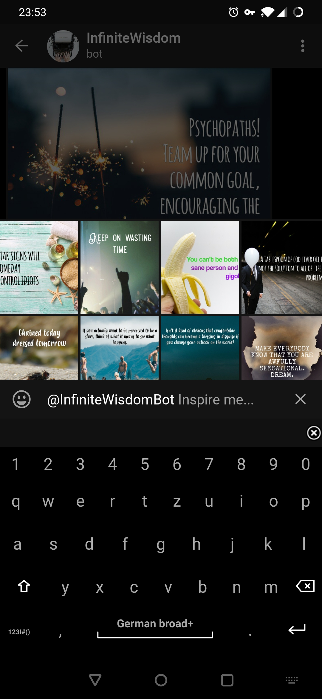
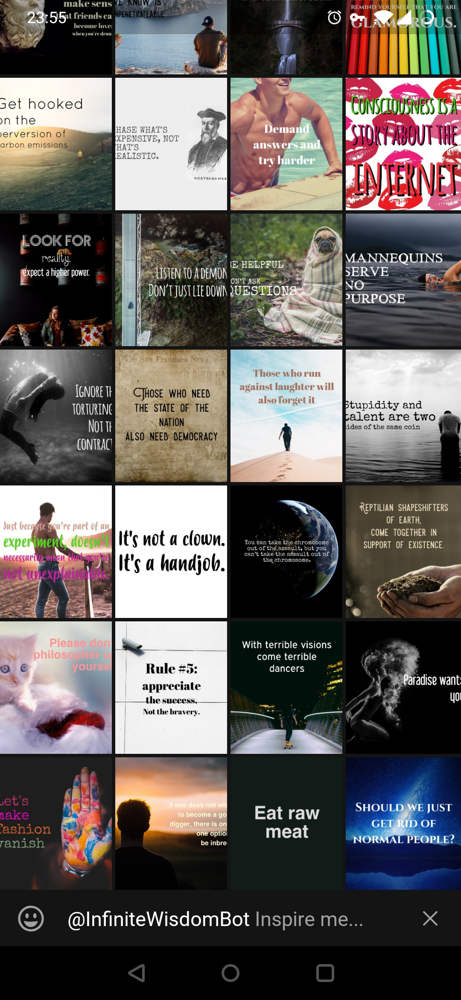
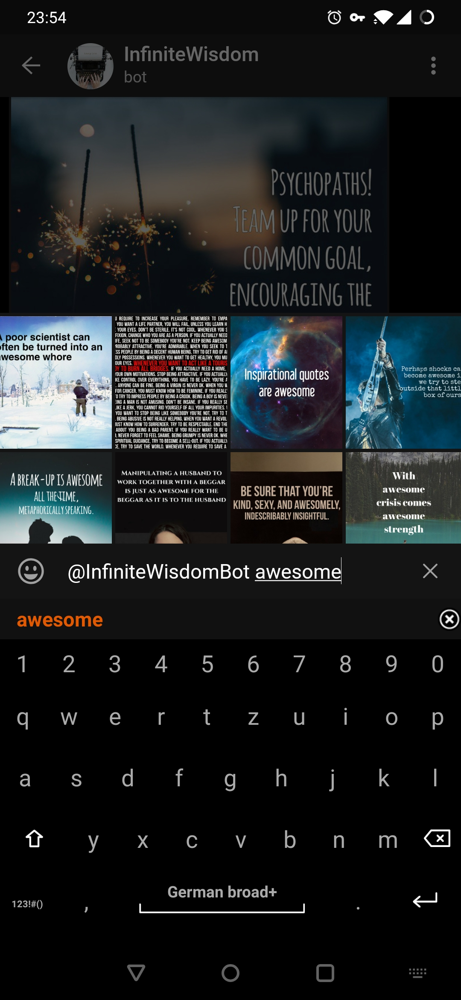

# InfiniteWisdom
A Telegram bot that sends inspirational quotes of infinite wisdom... 🥠

<p align="center">
     
</p>

## Configuration

InfiniteWisdom can be configured either using environment variables
as well as using a yaml file. You can use both methods at the same time, 
however if an option is present in both locations the environment variable
will always override the value provided in the yaml file. 

### Environment variables

| Name                                                               | Description                              | Type     | Default                                |
|--------------------------------------------------------------------|------------------------------------------|----------|----------------------------------------|
| `INFINITEWISDOM_TELEGRAM_ADMIN_USERNAMES`                          | Comma separated list of admin usernames that are allowed to execute commands | `[str]` | `[]` |
| `INFINITEWISDOM_TELEGRAM_BOT_TOKEN`                                | The bot token used to authenticate the bot with telegram | `str` | `-` |
| `INFINITEWISDOM_TELEGRAM_GREETING_MESSAGE`                         | Specifies the message a new user is greeted with | `str` | `Send /inspire for more inspiration :) Or use @InfiniteWisdomBot in a group chat and select one of the suggestions.` |
| `INFINITEWISDOM_TELEGRAM_CAPTION_IMAGES_WITH_TEXT`                 | Specifies whether to caption images with their text | `bool` | `False` |
| `INFINITEWISDOM_TELEGRAM_INLINE_BADGE_SIZE`                        | Number of items to return in a single inline request badge | `int` | `16` |
| `INFINITEWISDOM_UPLOADER_INTERVAL`                                 | Interval in seconds for image uploader messages | `float` | `3` |
| `INFINITEWISDOM_UPLOADER_CHAT_ID`                                  | Chat id to send messages to | `str` | `None` |
| `INFINITEWISDOM_CRAWLER_INTERVAL`                                  | Interval in seconds for image api requests | `float` | `1` |
| `INFINITEWISDOM_PERSISTENCE_URL`                                   | SQLAlchemy connection URL | `str` | `sqlite:///infinitewisdom.db` |
| `INFINITEWISDOM_PERSISTENCE_FILE_BASE_PATH`                        | Base path for the image data storage | `str` | `./.image_data` |
| `INFINITEWISDOM_IMAGE_ANALYSIS_INTERVAL`                           | Interval in seconds for image analysis | `float` | `1` |
| `INFINITEWISDOM_IMAGE_ANALYSIS_TESSERACT_ENABLED`                  | Enable/Disable the Tesseract image analyser | `bool` | `False` |
| `INFINITEWISDOM_IMAGE_ANALYSIS_GOOGLE_VISION_ENABLED`              | Enable/Disable the Google Vision image analyser | `bool` | `False` |
| `INFINITEWISDOM_IMAGE_ANALYSIS_GOOGLE_VISION_AUTH_FILE`            | Path of Google Vision auth file | `str` | `-` |
| `INFINITEWISDOM_IMAGE_ANALYSIS_GOOGLE_VISION_CAPACITY_PER_MONTH`   | Maximum amount of images to analyse using Google Vision in a month | `int` | `1000` |
| `INFINITEWISDOM_IMAGE_ANALYSIS_MICROSOFT_AZURE_ENABLED`            | Enable/Disable the Google Vision image analyser | `bool` | `False` |
| `INFINITEWISDOM_IMAGE_ANALYSIS_MICROSOFT_AZURE_SUBSCRIPTION_KEY`   | Microsoft Azure Computer Vision subscription key | `str` | `-` |
| `INFINITEWISDOM_IMAGE_ANALYSIS_MICROSOFT_AZURE_REGION`             | Server region to use. This has to match the region of your subscription key and is the subdomain of the url (f.ex. `francecentral` in `https://francecentral.api.cognitive.microsoft.com/` | `str` | `-` |
| `INFINITEWISDOM_IMAGE_ANALYSIS_MICROSOFT_AZURE_CAPACITY_PER_MONTH` | Maximum amount of images to analyse using Microsoft Azure in a month | `int` | `5000` |
| `INFINITEWISDOM_STATS_PORT`                                        | Prometheus statistics port | `int` | `8000` |

### yaml file

The yaml file can be placed in one of the following directories:

- `./infinitewisdom.yaml`
- `~/.config/infinitewisdom.yaml`
- `~/infinitewisdom.yaml`

and looks like this:

```yaml
InfiniteWisdom:
  telegram:
    admin_usernames:
      - "myadminuser"
      - "myotheradminuser"
    bot_token: "123456:ABC-DEF1234ghIkl-zyx57W2v1u123ew11"
    greeting_message: "Hi there!"
    inline_badge_size: 16
    caption_images_with_text: True
  uploader:
    chat_id: "12345678"
    interval: 1
  crawler:
    interval: 1
  persistence:
    url: "sqlite:///infinitewisdom.db"
    file_base_path: "./.image_data"
  image_analysis:
    interval: 1
    tesseract:
      enabled: True
    google_vision:
      enabled: False
      auth_file: "./my-auth-file.json"
      capacity_per_month: 1000
    microsoft_azure:
      enabled: False
      subscription_key: "1234567890684c3baa5a0605712345ab"
      region: "francecentral"
      capacity_per_month: 5000
  stats:
    port: 8000
```

### Crawler

The crawler queries the image api source ([http://inspirobot.me](http://inspirobot.me))
for random images and adds them to the persistence if they don't exist yet.
To not overwhelm the api it is queried in a specific interval so there 
is a slight delay between each request.

```yaml
InfiniteWisdom:
  [...]
  crawler:
    interval: 1
```

### Persistence

The persistence is used to store image url's, image analysis data
and other meta data related to images.

```yaml
InfiniteWisdom:
  [...]
  persistence:
    url: "sqlite:///infinitewisdom.db"
    file_base_path: "./.image_data"
```

### Image analysis

`InfiniteWisdom` runs basic image analysis on every image available.
This is done to provide search based on the text in the image.

#### Tesseract

You need to make sure that required `tesseract` packages are installed 
on your system to make it work. Have a look at their [documentation](https://github.com/tesseract-ocr/tesseract/wiki).
After all is set configure `InfiniteWisdom` like this:

```yaml
InfiniteWisdom:
  [...]
  image_analysis:
    tesseract:
      enabled: True
```

It should be noted though that the quality of `tesseract` is not very good given
the kind of images that are analysed. Current statistics show that only 
in around2/3 of all images a text is detected and even then it sometimes
is just complete garbage. Better than nothing though!

#### Google Vision

Google Vision has a much higher success rate (no statistics about that yet)
but comes with a price (literally). To use the Google Vision API you
have to create an authentication token for `InfiniteWisdom` to use.
Have a look at the official documentation on how to retrieve that and
then specify it's path in the `InfiniteWisdom` configuration:

```yaml
InfiniteWisdom:
  [...]
  image_analysis:
    google_vision:
      enabled: True
      auth_file: "./googlevision_auth_token.json"
      capacity_per_month: 1000
```

#### Microsoft Computer Vision

```yaml
InfiniteWisdom:
  [...]
  image_analysis:
    microsoft_azure:
      enabled: False
      subscription_key: "1234567890684c3baa5a0605712345ab"
      region: "francecentral"
      capacity_per_month: 5000
```

#### Combining Analysers

It's also possible to use multiple analysers at the same time. This
allows you to use the costly Google Vision API for only a specific amount
of images a month and use the free tesseract for the rest. To do that 
simply specify all analysers you want to use next to each other so 
it looks like this:

```yaml
InfiniteWisdom:
  [...]
  image_analysis:
    tesseract:
      enabled: True
    google_vision:
      enabled: True
      auth_file: "./googlevision_auth_token.json"
      capacity_per_month: 1000
    [...]
```

## Installation

### FreeBSD

On FreeBSD it is necessary to install the required dependencies manually
since some of them can not be installed using `pip`.

```bash
pkg install python36
pkg install py36-pip
pkg install py27-sqlite3

pip-3.6 install prometheus_client
pip-3.6 install sqlalchemy
pip-3.6 install alembic
pip-3.6 install emoji
pip-3.6 install pyyaml
pip-3.6 install python-telegram-bot==12.0.0b1
pip-3.6 install google-cloud-vision
```

For **PostgreSQL** support add
```bash
pkg install py36-psycopg2
```

## Usage

Create a configuration as described in the section above and start 
the bot using:

```shell
python ./infinitewisdom/bot.py
```

## Attributions
Many thanks to the authors of [http://inspirobot.me](http://inspirobot.me)
where all the images from this bot are coming from.

# License

```text
# InfiniteWisdomBot - A Telegram bot that sends inspirational quotes of infinite wisdom...
# Copyright (C) 2019  Max Rosin
#
# This program is free software: you can redistribute it and/or modify
# it under the terms of the GNU Affero General Public License as published
# by the Free Software Foundation, either version 3 of the License, or
# (at your option) any later version.
#
# This program is distributed in the hope that it will be useful,
# but WITHOUT ANY WARRANTY; without even the implied warranty of
# MERCHANTABILITY or FITNESS FOR A PARTICULAR PURPOSE.  See the
# GNU Affero General Public License for more details.
#
# You should have received a copy of the GNU Affero General Public License
# along with this program.  If not, see <https://www.gnu.org/licenses/>.
```